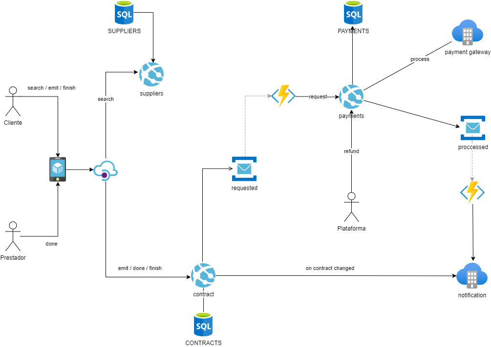
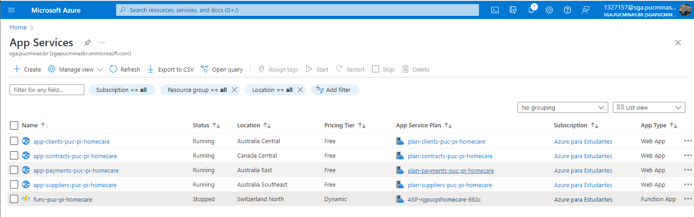
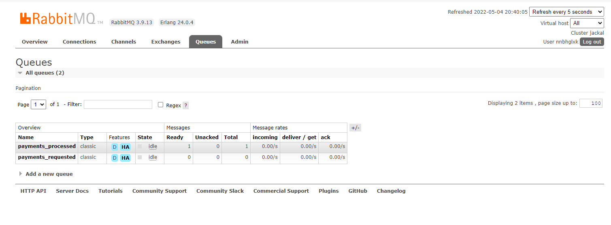
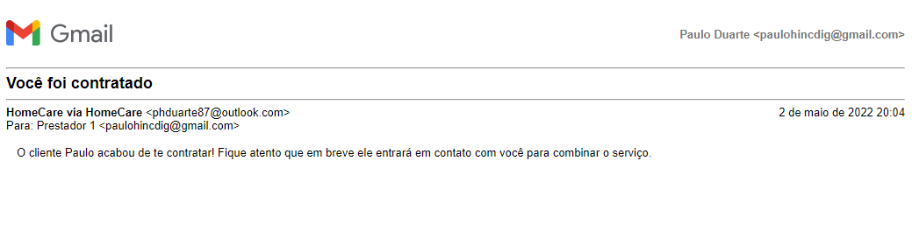
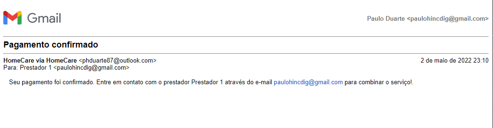
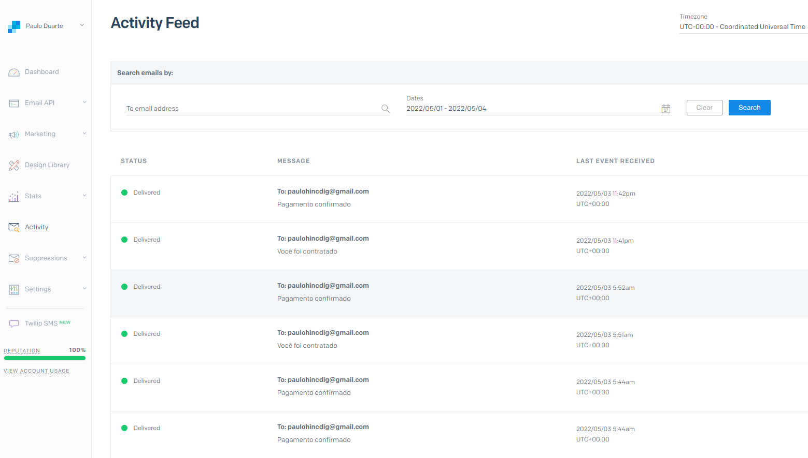

# Projeto Integrado

### Tema
Aplicativo para contratação de serviços gerais

### Objetivo
Desenvolver um aplicativo PWA para gerenciar o processo de contratação e confirmação de prestação de serviços utilizando arquitetura em microserviços e baseada em eventos.

### Sumário

- [Cronograma](#cronograma)
- [Design Thinking](#design-thinking)
- [MVP](#mvp)
- [Requisitos](#an%C3%A1lise)
- [Arquitetura](#arquitetura)
- [Registro de Decisões](#registro-de-decis%C3%B5es-arquiteturais-adr)
- [Construção](#constru%C3%A7%C3%A3o)
- [Referências](#refer%C3%AAncia-1)

# Cronograma

1. [X] Workshop
2. [X] Especificações
3. [X] Documento de Arquitetura
4. [X] Criar Documento OpenAPI
5. [X] Criar Projeto Backend (depende do item 3)
6. [X] Criar Client PWA (depende do item 3)
7. [ ] Documentação e revisão do estudo (depende do item 6)
8. [ ] Preparar a apresentação (depende do item 7)

# Design Thinking

## Objetivo

Design Thinking não tem relação com design gráfico, o objetivo dele é estimular a definição de um contexto através de um workshop em formato de debate, onde são abordados temas que ajudam a elicitar funcionalidades do sistema. 

Aqui temos um checklist que serve como base para condução da reunião e posteriormente registro de uma forma ampla aqui.

Como resultado deste workshop será gerado o [MVP](/Projeto-Integrado-%2D-Contratação-de-Serviços-Gerais/2.-MVP) que utilizaremos para a PoC.

## Roteiro

### Briefing
- [X] Hipótese
- [X] Inovação
- [X] Focar na doença e não no sintoma
- [X] Standing in the Shoes "Vestir o sapato de quem manifestou o problema"

Ex: Se eu tiver um aplicativo que dá pra cadastrar serviços e buscar profissionais, eu poderia ...

### Restrições

- [X] Tempo : De acordo com o calendário do curso aprox. 1 mês.
- [X] Dinheiro : Pode ser executado localmente, eliminando o custo com cloud.
- [x] Público Alvo : Pra essa versão não tem.
- [X] Acessibilidade : Pra essa versão não tem.
- [X] Tecnologia : .NET Core, RabbitMQ

Ex: Pelo público alvo do sistema, ele precisa ser XXX. Precisa estar no ar antes de XXXX devido prazo para avaliação da PoC...

### Definição do Problema

- [X] Empatia : Pegamos como base um cenário real enriquecido com as experiências dos integrantes do workshop e conseguirmos identificar alguns problemas que o usuário teria ao tentar procurar e contratar um serviço.
- [X] Decidir : Conseguimos separar problemas e identificar qual seria o foco principal que traz maior risco, ou que causaria mais problemas.

### Definição da Solução

- [X] Idear : Definimos uma proposta de negócio simplificada, focada em viabilizar a prestação de serviço e gerenciamento do pagamento com garantia de resiliência.
- [X] Prototipar : Como protótipo iremos ter um aplicativo web PWA contendo 2 telas principais, sendo 1 para o cliente e outra para o prestador e 1 para login batendo num backend que possuirá as regras de negócio e lógicas de acesso a dados e integração com parceiros.
- [X] Testar : Cliente entra com seus dados no aplicativo e é redirecionado para a respectiva página de acordo com o tipo de seu acesso. Sendo um cliente, ele poderá buscar por um serviço específico, incluíndo sua localização e a abrangência da busca medida pelo raio de sua localização, e o critério de priorização dos resultados, sendo eles, por preço ou por qualidade. O aplicativo irá exibir todos prestadores disponíveis e ele poderá contratar um clicando no botão "Contratar" onde terá acesso a outra tela onde ele fornecerá os dados de pagamento. Após o pagamento ser aprovado ele terá acesso aos dados do prestador de serviço. O Prestador de serviço receberá um e-mail contendo o link do aplicativo onde ele poderá informar a finalização para que o dinheiro seja liberado.

### Referências

Aula 1 - Análise, Projeto e Avaliação de Arquitetura de Software - Prof. Eduardo Batista Oliveira Santos

[Voltar para o topo](#projeto-integrado)

# MVP

## Objetivo
Cliente conseguir encontrar prestadores de serviço conforme sua necessidade, pagar o serviço e em caso de algum problema na execução, poder ter o seu dinheiro de volta.

Prestador poder receber o dinheiro após a execução do serviço.

## História

- Cliente busca por prestadores disponíveis na região (num raio de X km).
- Ele visualiza uma lista de prestadores ordenados pelo preço ou avaliação.
- Escolhe um prestador e paga pelo serviço.
- Após o pagamento é liberado os dados de contato e o prestador é notificado.
- O cliente e o prestador negociam o serviço externamente.
- O prestador de serviço informa a conclusão do serviço.
- O cliente confirma a conclusão, avalia a qualidade do serviço prestado e libera o pagamento para o prestador.

## Regulamento

- Após a notificação de conclusão do serviço, caso o dinheiro não seja liberado pelo cliente em até 15 dias o aplicativo irá liberar automaticamente o dinheiro para o prestador.
- Caso o serviço não seja informado como concluído pelo prestador até 60 dias, o aplicativo irá liberar automaticamente o dinheiro 
- para o cliente.
- O cliente pode abrir uma disputa para reclamar sobre a não prestação do serviço a fim de evitar que o dinheiro seja liberado indevidamente.

O resultado detalhado deve virar especificações no documento de [Requisitos](/Projeto-Integrado-%2D-Contratação-de-Serviços-Gerais/3.-Requisitos).

[Voltar para o topo](#projeto-integrado)

# Análise

Contém o detalhamento das especificações do sistema.

## Requisitos Funcionais

| Cód. | Nome | Descrição |
|--|--|--|
| RF-001 | Pesquisar prestadores | Cliente busca por prestadores disponíveis na região (num raio de X km) |
| RF-002 | Ordenar pesquisa por preço | Cliente visualiza uma lista de prestadores ordenados pela oferta mais barata. |
| RF-003 | Ordenar pesquisa por avaliação | Cliente visualiza uma lista de prestadores ordenados pela avaliação de qualidade do prestador. |
| RF-004 | Visualizar prestador | Cliente escolhe um prestador e paga pelo serviço. |
| RF-005 | Selecionar prestador | Cliente escolhe um prestador e paga pelo serviço. |
| RF-006 | Pagar serviço | Cliente efetua o pagamento de um serviço para um prestador. |
| RF-007 | Confirmar pagamento | Plataforma confirma o recebimento do pagamento. |
| RF-008 | Liberar dados de contato | Plataforma libera os dados de contato do prestador para o cliente. |
| RF-009 | Notificar prestador | Plataforma notifica o prestador sobre a contratação informando os dados do cliente. |
| RF-010 | Informar conclusão do serviço | Prestador informa para a plataforma que o serviço está concluído. |
| RF-011 | Notificar cliente | Plataforma notifica o cliente pedindo confirmação de conclusão. |
| RF-012 | Confirmar a conclusão | Cliente confirma a conclusão. |
| RF-013 | Liberar o dinheiro manualmente | Plataforma libera o dinheiro para o prestador após confirmação do cliente. |
| RF-014 | Liberar dinheiro automaticamente | Caso o dinheiro não seja liberado pelo cliente em até 15 dias o aplicativo irá liberar automaticamente o dinheiro para o prestador. |
| RF-015 | Devolver dinheiro automaticamente | Caso o serviço não seja informado como concluído pelo prestador até 60 dias, o aplicativo irá liberar automaticamente o dinheiro para o cliente. |
| RF-016 | Abrir disputa | O cliente pode abrir uma disputa para reclamar sobre a não prestação do serviço a fim de evitar que o dinheiro seja liberado indevidamente. |

## Requisitos Não Funcionais

| Cód. | Nome | Descrição |
|--|--|--|
| RNF-002 | Assíncrono | Evita que o cliente um pagamento falhe caso o cliente feche o aplicativo ou que precise esperar por um longo tempo até que o pagamento seja confirmado. |
| RNF-003 | Resiliente | Garante que estágios importantes do sistema não sejam perdido em caso de falha, por exemplo registros no banco de dados ou notificações para o cliente. |

## Regras de Negócio

| Cód. | Nome | Descrição |
|--|--|--|
| RN-001 | Deve realizar negociações fora da plataforma | O cliente e o prestador negociam o serviço externamente |
| RN-002 | Deve liberar dinheiro para o prestador automaticamente após 15 dias | Caso o serviço não seja confirmado pelo cliente em até 15 dias o aplicativo irá liberar automaticamente o dinheiro para o prestador. |
| RN-003 | Deve devolver o dinheiro para o cliente após 60 dias | Caso o serviço não seja informado como concluído pelo prestador até 60 dias, o aplicativo irá liberar automaticamente o dinheiro para o cliente. |
| RN-004 | Deve bloquear liberação do dinheiro para o prestador caso o pagamento esteja em disputa | O cliente pode abrir uma disputa para reclamar sobre a não prestação do serviço a fim de evitar que o dinheiro seja liberado indevidamente. |
| RN-005 | Deve coletar taxa pelo pagamento do serviço | As operações de pagamento devem descontar um percentual como taxa do serviço pelo aplicativo, já incluso no valor informado ao cliente |
| RN-006 | Deve liberar o dinheiro somente após confirmação de conclusão |  |
| RN-007 | Deve liberar o contato somente após confirmação de pagamento |  |
| RN-008 | Deve exibir dados de contato apenas se o pagamento estiver confirmado |  |

## Casos de Uso

Esses são todos os casos de uso identificados através da análise dos requisitos.

## Sequência caso de uso UC03 - Pagar Serviço

Este foi o caso de uso mais crítido, por incluir validações de regras de negócio, integração com parceiros e persistência de dados. O que torna a visão de diagrama de sequência útil para a análise do comportamento e suas transições entre componentes.

[Voltar para o topo](#projeto-integrado)

# Arquitetura

## Desenho da Arquitetura do Software

O uso de uma arquitetura baseada em eventos é importante para garantir a consistência das informações. Lidando com informações de transações bancárias realizadas por um parceiro, isso garante que eventuais problemas de rede não afete a confiabilidade do aplicativo, tão pouco, gere risco financeiro.

## Referência

- Na matéria de Análise do Eduardo, a segunda aula fala sobre EDA (Arqtuitetura guiada por Eventos).
- Na matéria de API e WebServices fizemos um diagrama que pode ser usado como base.
- Na matéria de Backend exercitamos a visualização de microserviços e como e quando separá-los.

[Voltar para o topo](#projeto-integrado)

# Registro de Decisões Arquiteturais (ADR)

## Objetivo

Detalhamento do motivo de escolha de tecnologia, provedor ou ferramenta mais importante que foram escolhidas de acordo com o contexto do momento.

## Roteiro

- Listar atributos de qualidade necessários
- Atributos mais críticos devem ser priorizados (possuem um peso maior, estão ligadas ao negócio, mercado, riscos e desafios de sucesso do sistema)
- Diferenciar decisões de design e implementação
- Analisar Trade-offs (ponderação)

## Backend

### Curva de Aprendizado

Durante o curso tivemos acesso à 3 tecnologias para desenvolvimento backend, sendo, DotNet, Java e NodeJs.
Sintaticamente falando, as 3 são bastante semelhantes, principalmente DotNet e NodeJs.

### Benchmark Performance

O redesenho do framework .NET que resultou no .NET Core o tornou uma ótima alternativa para execução de código em servidores cloud devido sua velocidade de processamento e baixa carga, otimizando assim as requisições http e o warmup.

### Experiência da Equipe

A curva de aprendizado acabou sendo injusta com o NodeJs, pois os integrantes da equipe não possuem proficiência em NodeJs e a disciplina começou ser ministrada após o Projeto Integrado já estar em andamento. Como o objetivo da PoC não é comparar a adoção de uma plataforma, optamos em utilizar .NET Core dessa forma podemos focar os estudos no modelo de desenvolvimento orientado a eventos que é um objetivo da PoC.

### Conclusão

Fizemos uma avaliação no formato de matriz com critérios e ponderações baseadas no grau de importância para o projeto no momento da análise.

**Peso dos critérios:**

- 1 - Útil, mas não é obrigatório.
- 2 - Importante, se tiver será um diferencial.
- 3 - Crítico, é obrigatório ter.

## Mensageria

RabbitMQ é um servidor de mensageria Open Source desenvolvido em Erlang, implementado para suportar mensagens em um protocolo denominado Advanced Message Queuing Protocol (AMQP). Ele possibilita lidar com o tráfego de mensagens de forma rápida e confiável, além de ser compatível com diversas linguagens de programação, possuir interface de administração nativa e ser multiplataforma.

Por ser uma tecnologia de código aberto, matura e bem apoiada pela comunidade, o RabbitMQ se torna uma unanimidade até o momento dessa análise.

Nessa PoC, optamos por utilizar o RabbitMQ as a Service, o que traz a facilidade de manutenção da infrastrutura. O provedor [CloudAMQP](https://www.cloudamqp.com/) possui um plano de onboarding que oferece o ambiente gratuíto até completar 1 milhão de mensagens, o que parece ser suficiente para esse projeto até o momento da apresentação.

## Front End

Para definição da tecnologia utilizada no front end, seguimos os criterios, orientações e discussões aprendidos nas aulas de Arquitetura de Front Ends. O framework ecolhido foi o React, seguindo os critérios abaixo:

### Facilidade de desenvolvimento:
Possui uma ótima documentação e é um dos frameworks mais utilizados para desenvolvimento front-end, com 186mil estrelas no github, e tem uma comunidade bastante ativa e solicita em fóruns. A configuração inicial é mais simples e rápida, podendo ir adicionando ferramentas JavaScript conforme a aplicação cresce, sendo recomendada inúmeras ferramentas para aplicações grandes, sendo que elas exigem poucas ou nenhuma configuração. Como toda tecnologia possui uma curva de aprendizado, sendo necessário estudo e prática, sendo um framework desenvolvido com a linguagem JavaScript é necessário conhecimento prévio.

### Arquitetura:
O React é fundamentado em componentes, que são objetos JavaScript e possuem propriedades, estado e um ciclo de vida gerenciado pelo framework, com o objetivo de atualizar o DOM de forma organizada e fácil. Utiliza a sintaxe JSX para organizar a renderização dos componentes. JSX foi criado pela equipe de desenvolvimento do React, para criação de componentes usados como template, misturando código JavaScript com código HTML. O JSX não é interpretado pelos navegadores, sendo necessário utilizar um transpilador para fazer a conversão, que são utilizados para facilitar o desenvolvimento dos componentes, porém não é obrigatório o uso, o React oferece APIs nativas do ECMAScript.
O ciclo de vida de um componente é dividido em montagem, atualização, desmontagem e tratamento de erros, cada parte do ciclo de vida possui métodos que podem ser sobrescritos conforme necessidade. Sendo o único de uso obrigatório o método render, que quando executado atualiza o DOM, ocorrendo na alteração do estado ou criação do componente. Para realizar a leitura dos dados de um componente é utilizado o método this.state e para atualizar é utilizado o método setState, ou por meio de Hooks que são uma nova adição ao React 16.8, e permitem que você use o state e outros recursos do React sem escrever uma classe.

### Componentização:
Em React os componentes são definidos como classes ou funções, quando definidos como classes eles possuem mais funcionalidades, porém os Hooks introduzidos a partir do React 16.8 vieram para resolver esse problema. Para definir um componente como classe é preciso estender React.Component, sendo preciso definir o método render na subclasse. A renderização dos componentes em React são feitas por meio do método render, dentro do próprio componente.

### Performance:
A usabilidade e a performance esperadas em um PWA praticamente exigem ser uma single page application (SPA). 
O React utiliza o virtual DOM para renderizar os componentes, a manipulação do virtual DOM é mais performática do que a manipulação o DOM, quando é feito a alteração do componente, o React cria uma nova árvores com os componentes no virtual DOM, calcula a diferença entre a árvore antiga e nova e atualiza o DOM com apenas as diferenças.
Por ser uma PWA, o JavaScript será baixado e ficará no Application Cache do navegador. A página precisa estar disponível em poucos segundos, e isso inclui o primeiro acesso. Outro ponto importante é a utilização de componentes conforme necessidade do projeto.
O react é one-way binding, a transição dos dados entre o DOM e os componentes são somente em uma direção, o estado e as propriedades do componente são copiados para o DOM somente por meio do método render, e os dados do DOM são enviados por meio de eventos. Fazendo com que o desenvolvimento seja mais simples e baseado em funções e facilita o entendimento do código.
Do ponto de vista de performance, o melhor é atualizar quando for necessário atualizar, como clicando em no botão para submeter o formulário, ao invés de atualizar os atributos no JavaScript todas vez que as tags são alteradas. O React ganha sentido porque ele enfatiza fortemente a atualização do estado dos objetos via eventos. Ele condena o acesso aos componentes explicitamente, e isso torna-o simples, rápido e de fácil entendimento.
O livro Progressive Web APPs trás a comparação de renderização no navegador entre os principais frameworks front de mercado. O gráfico representa em milissegundo o tempo necessário para renderização no navegador redesenhar a página e o React se destaca nitidamente.

Pontes, Guilherme. Progressive Web Apps . Casa do Código. Pesqueisa realizada pelo site auth0.com (PEYROTT, 2016)

### Documentação:
 A documentação assume o conhecimento prévio sobre programação com a linguagem JavaScript, recomendando uma revisão sobre ela. Ela considera os diferentes conhecimentos e métodos de aprendizado, possuindo seções específicas de tutorial prático ou guia detalhado. A documentação sempre reflete a última versão estável do framework. Para iniciantes que tiverem dificuldades com a documentação, possui um link para um tutorial com os principais conceitos do React. Possui referência para determinadas API específica do React.Possui um glossário com os principais termos da documentação. Possui uma FAQ para perguntas e respostas sobre assuntos comuns. Faz recomendações de cursos e livros.
 
### Suporte da comunidade (dúvida em fóruns, stackoverflowe etc):
Possui o fórum do React que está no GitHub da Meta (facebook) ou o fórum do steackoverflow, onde conseguimos identificar a participação ativa e interação entre as pessoas respondendo as perguntas e compartilhando conhecimentos. Analisando o gráfico de download da npm trends, podemos perceber o número gigantesco de pessoas interessadas no React no último ano.

- [app](https://google.com.br)

[Voltar para o topo](#projeto-integrado)

# Construção

## Back-End

### Microserviços

Através da conta de estudante disponibilizada pela PUC criamos vários serviços de aplicativo, cada um em uma localização diferente. Apesar de não ter sido identificado como requisito não funcional para o sistema, a possibilidade de utilizar diferentes localização pode ser aproveitada como uma estratégia de otimização de custo, em situações onde um microserviço possui menor criticidade e a baixa latência não é um risco para a aplicação, pode se adotar datacenters conforme o menor custo.

Abaixo deixamos disponível o swagger de cada um dos serviços:

- [clientes](https://app-clients-puc-pi-homecare.azurewebsites.net/swagger)
- [prestadores](https://app-suppliers-puc-pi-homecare.azurewebsites.net/swagger)
- [contratos](https://app-contracts-puc-pi-homecare.azurewebsites.net/swagger)
- [pagamentos](https://app-payments-puc-pi-homecare.azurewebsites.net/swagger)

### Eventos

Utilizamos o provedor [cloudamqp](https://www.cloudamqp.com) que oferece o serviço de RaaS (RabbitMq as a Service).

Quando uma mensagem uma Azure Functions realiza o tratamento da mensagem enviando para o microserviço responsável pela execução da regra.

### Notificações

No nosso fluxo, sempre que um prestador é contratado é enviado um e-mail para lhe informar que o cliente entrará em contato e também um e-mail para o cliente informando os dados de contato do prestador.

Também é enviado um e-mail para o cliente quando o prestador informa que o serviço já foi feito e para o prestador quando o cliente finaliza o contrato.
 

Criamos uma conta na plataforma SendGrid da Twillo para utilizamos sua api de envio de e-mails.

[Voltar para o topo](#projeto-integrado)

# Uso

### Testando através do Postman

Faça o download do arquivo do postman [aqui](/doc/HomeCare%20-%20Azure.postman_collection.json)

Siga os passos a seguir:

1. Faça uma requisição no endpoint de Login do cliente para obter um clientId.
2. Através do endpoint de fornecedores, faça uma busca para localizar um supplierId.
3. No endpoint de emissão de contratos, faça uma requisição informando o clientId e o supplierId coletados nos passos anteriores. Essa requisição lhe fornecerá um contractId.
4. No entpoint de pagamentos por contractId, informe o contractId recebido no passo anterior.

Os últimos 2 passos ocorrem de forma assíncrona, então pode ser que o pagamento leve um tempo para atualizar seus status. Repita o passo 4 até que o pagamento tenha um evento com status de confirmado.

Os processos podem ficar ser desligados caso fiquem muito tempo sem receber requisição e isso poderá gerar lentidão devido ao warmup na primeira requisição de cada microserviço.

[Voltar para o topo](#projeto-integrado)

# Referência

- Aula 2 - Análise, Projeto e Avaliação de Arquitetura de Software - Eduardo
- Trabalho Final - Arquitetura Java - Fabio Leandro Rodrigues Cordeiro
- [RabbitMQ o que é e como utilizar](https://blog.cedrotech.com/rabbitmq-o-que-e-e-como-utilizar#:~:text=Dentre%20as%20aplicabilidades%20do%20RabbitMQ,fila%20de%20trabalhos%20em%20background.)
- [Javascript x CSharp](https://github.com/CharlieDigital/js-ts-csharp)
- [Documentação React] https://pt-br.reactjs.org/docs/getting-started.html
- Livro da casa do código: Pontes, Guilherme. Progressive Web Apps . Casa do Código.
